## 一、项目描述

##### 1.基本功能：

​		该项目语言为python3.11.5，基于Django3和BootStrap3。一个基础的员工信息管理、管理员的信息管理、靓号的管理、使用md5对密码进行加密加盐处理、使用了echarts和highcharts做数据展示、上传excel文件、分页和模糊查询等。

##### 2.环境：

​		windows10操作系统、python3.11.5、django3、bootstrap3、使用的IDE为pycharm2023专业版.

## 二、页面效果展示

### 1.登录页面

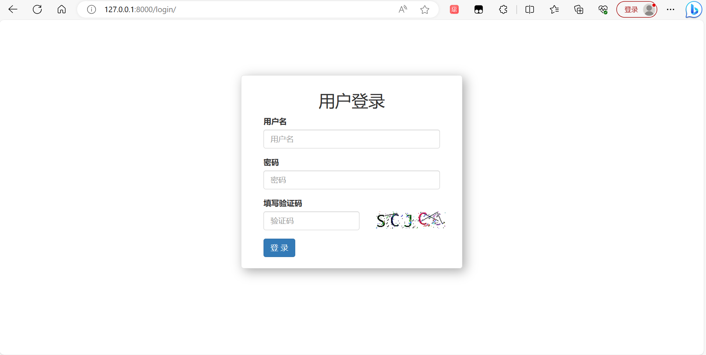

### 2.管理员页面

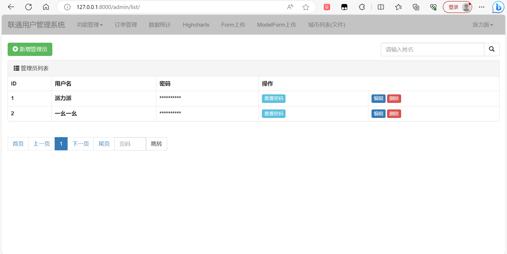

### 3.部门管理页面

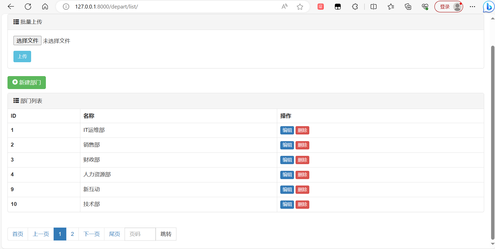

### 4.用户管理页面

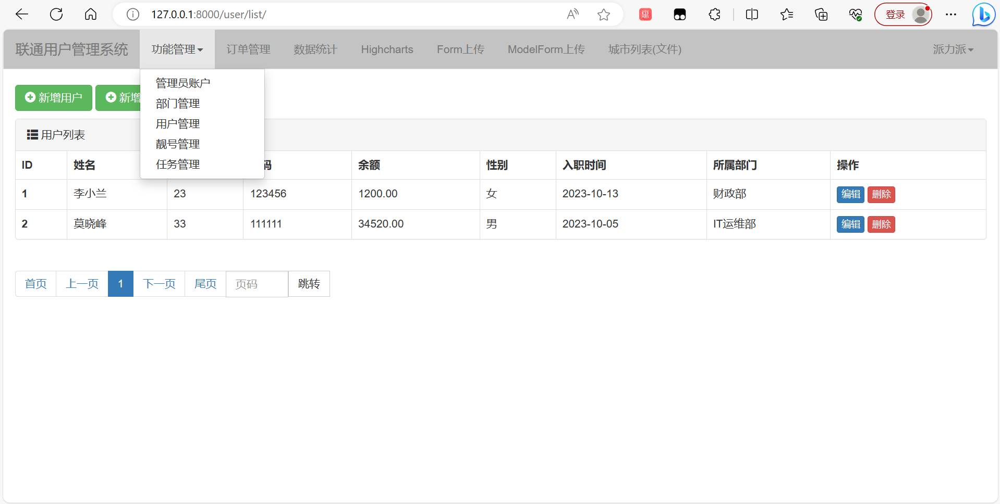

### 5.靓号管理页面

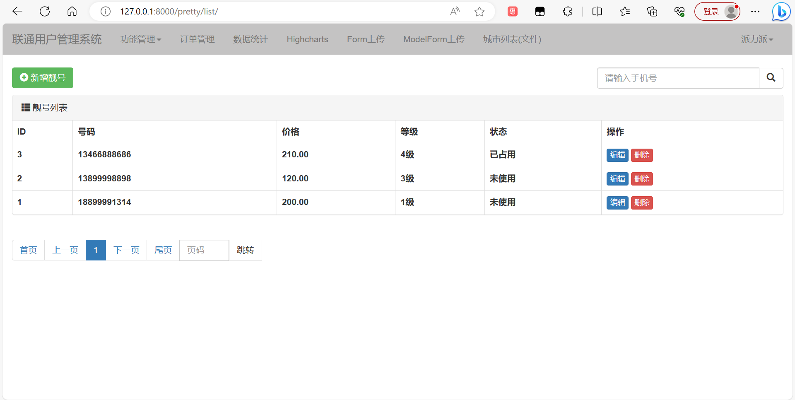

### 6.任务管理页面

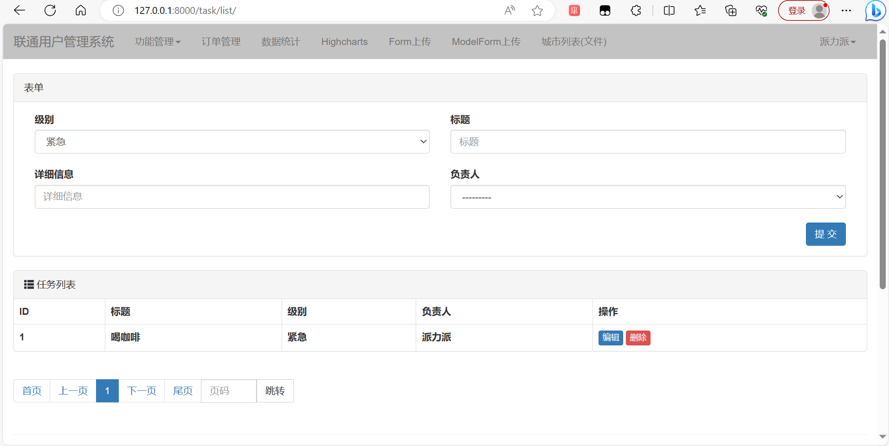

### 7.订单管理页面

### 8.数据统计页面

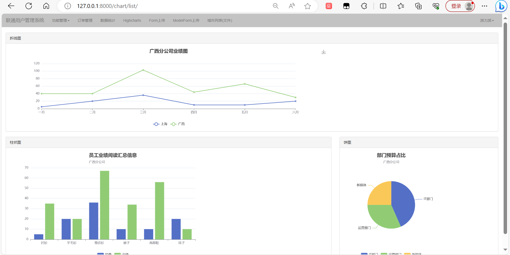

### 9.heightcharts数据统计页面

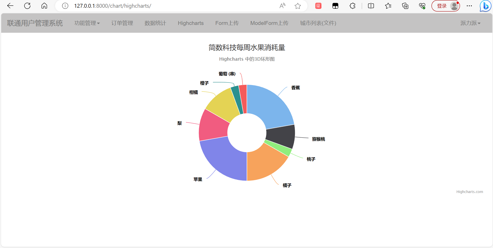

### 10.Form上传页面

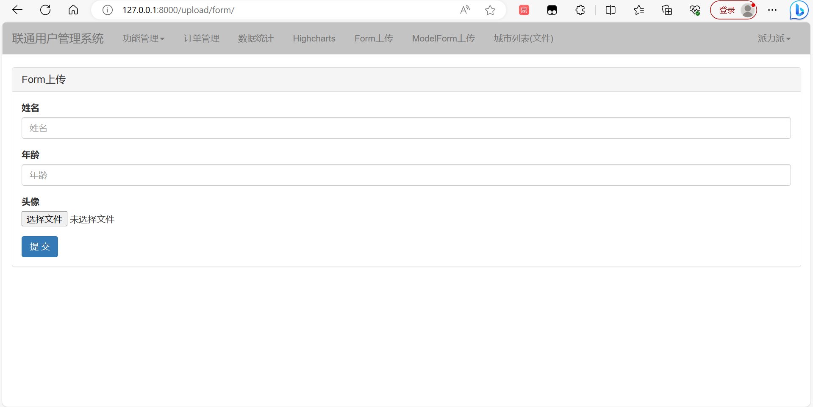

### 11.Modelform上传页面

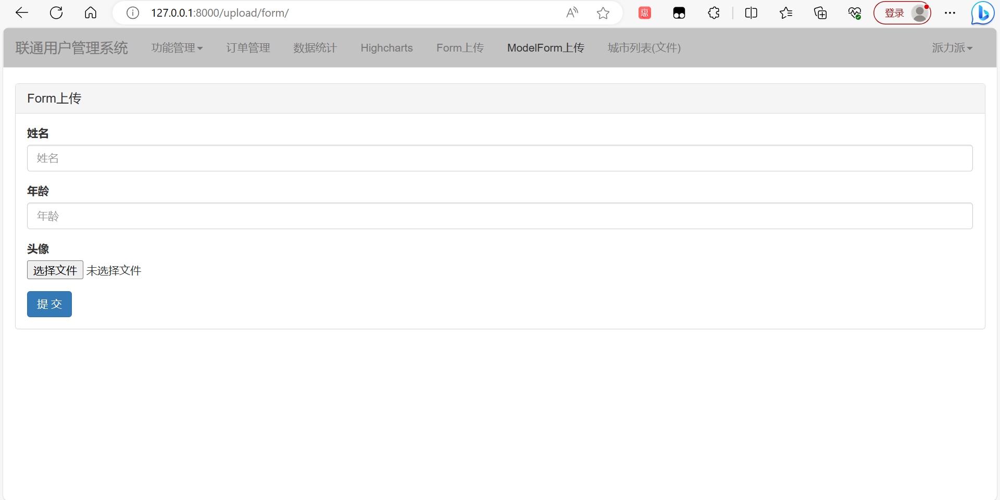

### 12.城市人口信息页面

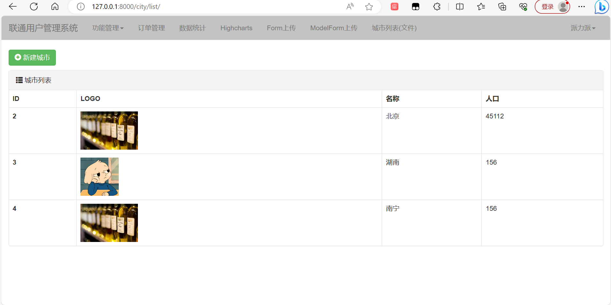